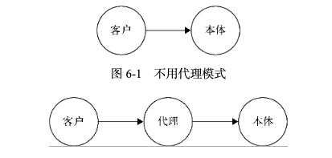

# 代理模式

代理模式是为一个对象提供一个代用品或占位符，以便控制对它的访问。现实中的例子：如果想请明星来办一场商业演出，只能联系他的经纪人，经纪人会把细节和报酬谈好后，再把合同交给明星签。



## 保护代理和虚拟代理

代理类可以控制对 target 类的访问权限，也就是说代理类可以拒绝特定类型的请求，称之为 **保护代理**

请求类中的一些操作可以放到代理类中去操作，称之为 **虚拟代理**

## 示例

### 图片预加载

下面的例子中，先用一张本地小菊花去展示给用户，然后悄悄地下载一张网络大图，待这张大图下载完毕，就替换小菊花。
可以看到两个函数都有

```ts
var myImage = (function() {
  var imgNode = document.createElement('img')
  document.body.appendChild(imgNode)
  return {
    setSrc: function(src: string) {
      imgNode.src = src
    },
  }
})()

var proxyImage = (function() {
  var img = new Image()
  img.onload = function() {
    myImage.setSrc(this.src)
  }
  return {
    setSrc: function(src: string) {
      myImage.setSrc('file:// /C:/Users/svenzeng/Desktop/loading.gif')
      img.src = src
    },
  }
})()
```
